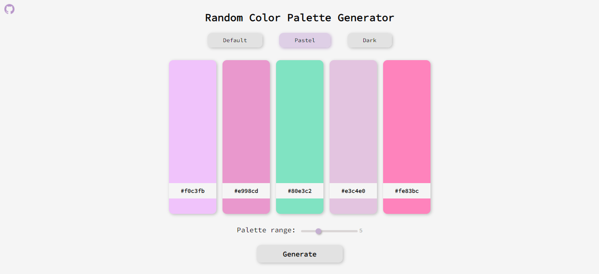

# Random Collor Palette Generator Website

 ## [SITE HERE](https://isabdch.github.io/random-color-palette-generator/)

## 📖 Table of Contents

- [Project Description](#project-description)
- [Status](#status)
- [Inspiration](#inspiration)

## ✏️ Project Description

A simple website that generates palettes with random colors. You can choose a range between 3 to 10 colors to show up and also the type of color of your choice: default, pastel, or dark colors. Each one of them shows its own HEX code.

Project is created with:

- ### HTML

  To create basic HTML content, buttons, inputs, etc.

- ### CSS

  To stylize the HTML elements. I used animation on the buttons to give them a cool visual and an appearance of more interactivity.

- ### JavaScript

  I used multiple events and functions to create the palette, give it all its respective colors accordingly to the type of color and its own HEX codes. Beyond that, I also added a function that makes it possible to choose the palette range.

## ⏱️ Status

For now, this project is finished. Possibly in the future I might add new features.

## 💡 Inspiration

Besides programming, I really enjoy drawing on digital. So it's very common for me to go searching for inspiration. I frequently go to [Coolors.co](https://coolors.co/) to get color palettes inspiration and eventually this project idea popped into my head. At the moment I'm studying JavaScript, so with all of this I could combine business with pleasure. I could practice my skills and also enjoy the project because it's related to something I like.
