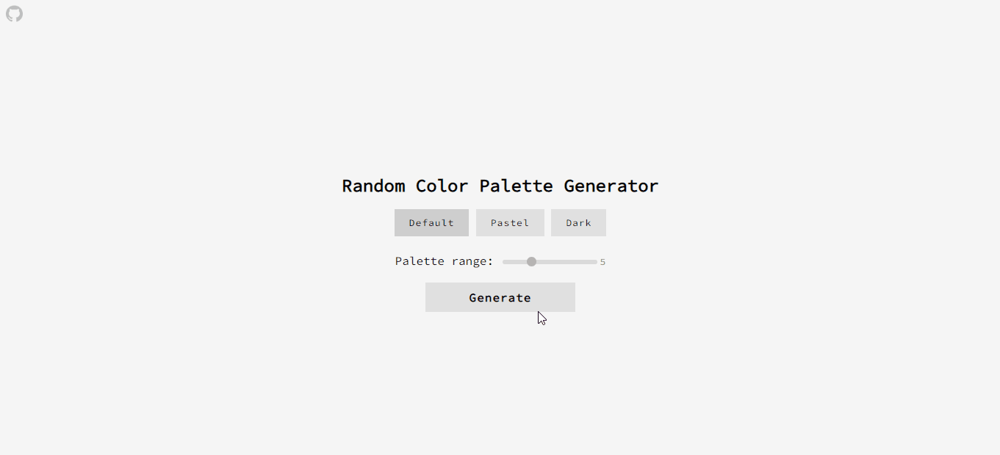

# Random Collor Palette Generator Website

 ## [SITE HERE](https://isabdch.github.io/random-color-palette-generator/)

## 📖 Table of Contents

- [Project Description](#project-description)
- [Status](#status)
- [Inspiration](#inspiration)

## ✏️ Project Description

A simple website that generates palettes with random colors. You can choose a range between 3 to 10 colors to show up and also the type of color of your choice: default, pastel, or dark colors. Each one of them shows its own HEX code.

Project is created with:

- ### HTML

- ### CSS

- ### JavaScript

## ⏱️ Status

This project is finished.

## 💡 Inspiration

Besides programming, I really enjoy drawing on digital. So I frequently go to [Coolors.co](https://coolors.co/) to get color palettes inspiration and eventually this project idea popped into my head and I could combine business with pleasure. I practiced my skills and also appreciated the project creation because it's related to something I enjoy.

---

Made with 💜 by Isabelle Brandão 👋 [See my LinkedIn](https://www.linkedin.com/in/isabelle-brand%C3%A3o-5645551a8/)
